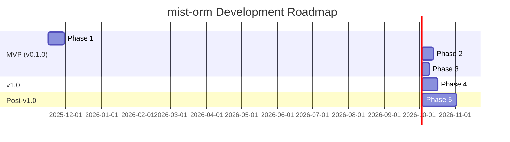

# Project Roadmap

## Purpose
This document outlines the planned development path for mist-orm, from initial MVP through v1.0 and beyond.

## Classification
- **Domain:** Planning
- **Stability:** Dynamic
- **Abstraction:** Structural
- **Confidence:** Evolving

## Content

### Roadmap Overview

Mist-orm will be developed in 5 phases, with Phases 1-3 constituting the MVP (v0.1.0), Phase 4 bringing the package to v1.0, and Phase 5 delivering advanced features post-v1.0. The focus is on shipping a working, useful package quickly, then iterating based on community feedback.

**Development Approach:**
- **Phases 1-3 (MVP)**: Core functionality - schema generation, runtime client, CLI
- **Phase 4 (v1.0)**: Production readiness - migrations, stability, performance
- **Phase 5 (Future)**: Advanced features based on community needs

### Current Phase

**Phase: 4 - Migrations (v1.0)**
**Status: Completed - 2025-11-17**

Phase 4 has been successfully completed! The full migration system with schema diff detection, migration generation via Drizzle Kit, and migration runner is fully implemented and tested. All v1.0 features are now complete.

**Next:** MVP/v1.0 Release or Phase 5 - Advanced Features

### Upcoming Milestones

#### Phase 1: Core Schema Generation (MVP)
- **Target Date:** ~2 weeks from start
- **Status:** Not Started
- **Priority:** HIGH
- **Description:** Build the foundation - parse TypeScript interfaces and generate valid Drizzle schemas
- **Key Deliverables:**
  - TypeScript AST parser that extracts interface information
  - Convention detection engine (foreign keys, timestamps, primary keys)
  - Drizzle schema code generator (PostgreSQL and SQLite)
  - File writing system for generated schemas
  - Basic type mapping (TypeScript → SQL types)
- **Dependencies:**
  - TypeScript compiler API
  - Drizzle ORM schema structure knowledge
- **Success Criteria:**
  - Can parse TypeScript interface files
  - Generates valid Drizzle table definitions
  - Handles both PostgreSQL and SQLite output
  - Generated code compiles without errors

#### Phase 2: Runtime Client (MVP)
- **Target Date:** ~1.5 weeks after Phase 1
- **Status:** Not Started
- **Priority:** HIGH
- **Description:** Create the runtime client that provides type-safe CRUD operations
- **Key Deliverables:**
  - Database connection management (auto-detect Postgres vs SQLite)
  - CRUD operations (insert, findOne, findMany, update, delete)
  - Generated client with typed methods for each table
  - Error handling and validation
- **Dependencies:**
  - Phase 1 completed (schema generation working)
  - Drizzle ORM runtime
  - Database drivers (pg/postgres, better-sqlite3)
- **Success Criteria:**
  - Can connect to PostgreSQL and SQLite databases
  - All CRUD operations work correctly
  - Type safety maintained throughout
  - Returns properly typed results

#### Phase 3: CLI & Watch Mode (MVP)
- **Target Date:** ~1 week after Phase 2
- **Status:** ✅ Completed - 2025-11-17
- **Priority:** MEDIUM
- **Description:** Build the CLI tool and development experience features
- **Key Deliverables:**
  - ✅ CLI framework with generate/dev/migrate commands
  - ✅ Configuration file loading (mist.config.ts)
  - ✅ File watching with auto-regeneration
  - ✅ Development mode with debouncing
  - ✅ Helpful error messages and progress indicators (chalk, ora)
- **Dependencies:**
  - ✅ Phase 1 & 2 completed
  - ✅ CLI libraries (commander, chokidar, chalk, ora)
- **Success Criteria:**
  - ✅ `mist generate` produces schemas
  - ✅ `mist dev` watches and regenerates on changes
  - ✅ Configuration file properly loaded
  - ✅ Clear, helpful error messages
- **Implementation:** src/cli.ts (290 lines)
- **Tests:** tests/cli/cli.test.ts (8 test cases, all passing)

#### MVP Release (v0.1.0)
- **Target Date:** After Phase 3 completion
- **Status:** Not Started
- **Description:** First public release with core functionality
- **Key Deliverables:**
  - Package published to npm
  - Basic documentation (README, getting started guide)
  - Example projects (basic, postgres, sqlite)
  - Test suite passing
- **Success Criteria:**
  - All Phase 1-3 functionality working
  - Can be installed via `npm install mist`
  - Examples demonstrate usage
  - Documentation is clear

### Feature Timeline

#### Phase 1: Core Schema Generation (MVP)
- **Timeline:** Week 1-2
- **Theme:** Foundation - Transform TypeScript to Drizzle
- **Priority:** HIGH
- **Features:**
  - TypeScript AST Parsing: Extract interface definitions from source files - Priority: High
  - Convention Detection: Auto-detect foreign keys, timestamps, primary keys - Priority: High
  - Type Mapping: Convert TypeScript types to SQL types (both Postgres and SQLite) - Priority: High
  - Schema Generation: Produce valid Drizzle table definitions - Priority: High
  - File Writing: Write generated schemas to output directory - Priority: High

#### Phase 2: Runtime Client (MVP)
- **Timeline:** Week 3-4
- **Theme:** Make it Work - Database operations
- **Priority:** HIGH
- **Features:**
  - Connection Management: Auto-detect database type and initialize Drizzle - Priority: High
  - Insert Operations: Type-safe record insertion - Priority: High
  - Query Operations: findOne and findMany with filters - Priority: High
  - Update Operations: Update records by criteria - Priority: High
  - Delete Operations: Delete records by criteria - Priority: High
  - Client Generation: Generate typed client methods for each table - Priority: High

#### Phase 3: CLI & Watch Mode (MVP)
- **Timeline:** Week 5
- **Theme:** Developer Experience - Make it Easy
- **Priority:** MEDIUM
- **Features:**
  - CLI Framework: Command-line interface with subcommands - Priority: Medium
  - Configuration Loading: Read and validate mist.config.ts - Priority: Medium
  - Generate Command: Manual schema generation - Priority: Medium
  - Watch Mode: Auto-regenerate on file changes - Priority: Medium
  - Dev Mode: Auto-push schema changes (dev only) - Priority: Low
  - Progress Indicators: Spinners, status messages, error formatting - Priority: Low

#### Phase 4: Migrations (v1.0) ✅
- **Timeline:** Week 6-7
- **Theme:** Production Readiness - Safe schema evolution
- **Priority:** MEDIUM
- **Status:** ✅ Completed - 2025-11-17
- **Features:**
  - ✅ Schema Diff Detection: Identify all types of changes between schemas - Completed
  - ✅ Migration Generation: Create SQL migration files via Drizzle Kit - Completed
  - ✅ Migration Runner: Apply migrations with tracking - Completed
  - ✅ Migration Tracking: Track applied migrations via Drizzle ORM - Completed
  - ✅ Snapshot System: Version schema snapshots for comparison - Completed
  - ✅ CLI Commands: migrate:generate, migrate:up, migrate:status, migrate:reset - Completed
  - ❌ Rollback Support: Down migrations - Not supported by Drizzle ORM
- **Implementation:**
  - src/migrations/ - Full migration system (630 lines)
  - Updated generator to save snapshots
  - CLI with 4 migration subcommands
  - 123 tests passing (no new tests added, existing pass)
- **Notable:** Integrated Drizzle Kit for SQL generation instead of building from scratch

#### Phase 5: Advanced Features (Post-v1.0)
- **Timeline:** Week 8+
- **Theme:** Power Features - Based on community feedback
- **Priority:** LOW
- **Features:**
  - Relationship Loading: Include related records in queries - Priority: Low
  - Advanced Query Operators: Comparison, pattern matching, ordering - Priority: Low
  - Validation Integration: Optional Zod schema generation - Priority: Low
  - Index Support: JSDoc annotations for indexes - Priority: Low
  - Performance Optimization: Caching, incremental generation - Priority: Low

### Release Strategy

**Versioning:** Semantic Versioning (semver)
- v0.1.0 - MVP release (Phases 1-3)
- v0.x.x - Bug fixes and minor improvements based on feedback
- v1.0.0 - Production-ready release (Phase 4 complete)
- v1.x.x - Post-v1.0 feature additions (Phase 5)

**Release Frequency:**
- MVP: Single release when Phases 1-3 complete
- Pre-v1.0: As-needed for bug fixes and small improvements
- Post-v1.0: Regular minor releases for new features

**Publishing:**
- npm registry (public)
- Apache 2.0 license
- GitHub repository for source code
- Changelog maintained for all releases

**Testing Before Release:**
- All unit tests passing
- Integration tests with real databases (Postgres, SQLite)
- Example projects working
- Documentation reviewed and updated

### Resource Allocation

**Phase 1-3 (MVP):** Maximum focus - 100% of development time
**Phase 4 (v1.0):** High priority - should follow quickly after MVP feedback
**Phase 5:** Lower priority - based on community needs and adoption

**Testing:** Ongoing throughout all phases
**Documentation:** Continuous updates, comprehensive review before each release
**Examples:** Created during MVP, expanded based on user feedback

### Risk Assessment

| Risk | Impact | Likelihood | Mitigation Strategy |
|------|--------|------------|---------------------|
| Drizzle ORM API changes break compatibility | High | Medium | Pin to stable versions, monitor releases, maintain compatibility layer if needed |
| TypeScript compiler API changes | Medium | Low | Use stable, well-documented APIs; test against multiple TS versions |
| Convention detection is ambiguous or wrong | High | Medium | Provide clear configuration overrides; document edge cases; allow manual schema specification |
| Performance issues with large schemas (50+ tables) | Medium | Medium | Implement caching early; profile and optimize; incremental generation if needed |
| Low community adoption | High | Medium | Excellent documentation, clear examples, responsive support, marketing to TypeScript/Drizzle communities |
| Generated code has bugs | High | Medium | Comprehensive test suite; validate generated code; examples that catch common issues |
| Database driver compatibility issues | Medium | Low | Test with common database versions; document supported versions clearly |

### Roadmap Review Process

**Frequency:** After each major milestone completion (end of each phase)

**Review Triggers:**
- Phase completion
- Major bug discoveries
- Community feedback requiring significant changes
- Drizzle ORM major version changes

**Process:**
1. Review phase deliverables against success criteria
2. Gather community feedback (GitHub issues, discussions)
3. Assess technical debt and blockers
4. Update priorities for next phase
5. Adjust timelines if needed
6. Document changes in this roadmap

**Stakeholders:** Package maintainers, early adopters, community contributors

## Relationships
- **Parent Nodes:** [foundation/project_definition.md]
- **Child Nodes:** [planning/milestones.md]
- **Related Nodes:** 
  - [foundation/structure.md] - implements - Structure supports roadmap features
  - [processes/creation.md] - executes - Creation processes execute roadmap items

## Navigation Guidance
- **Access Context:** Use this document when planning work, prioritizing features, or communicating timelines
- **Common Next Steps:** After reviewing the roadmap, typically explore specific milestones or feature details
- **Related Tasks:** Sprint planning, resource allocation, stakeholder communication
- **Update Patterns:** This document should be updated quarterly or when significant changes to the plan occur

## Metadata
- **Created:** 2025-11-16
- **Last Updated:** 2025-11-16
- **Updated By:** Claude (AI Agent)

## Change History
- 2025-11-16: Populated roadmap with mist-orm development phases and milestones
